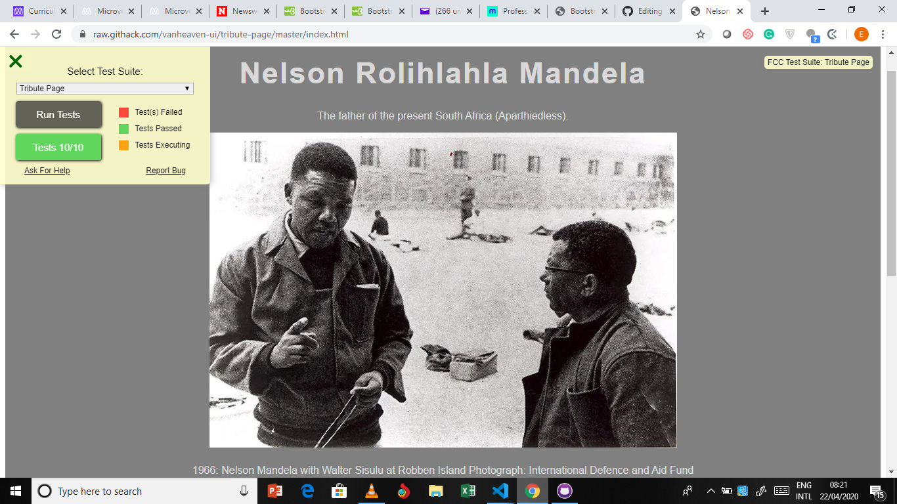

# Tribute Page

> This project was completed during Microverse remote software development pre-trials. The requirement was to collaborate with another developer to build a simple tribute page in any language or framework of choice.
We built this simple page using HTML and CSS with emphasis on passing the scipt tests that were embedded to check project. The project would be marked complete if all the checks are passed. 

Additional description about the project and its features.

## Built With

- HTML and CSS,

## Live Demo

[Live Demo Link](https://raw.githack.com/vanheaven-ui/tribute-page/master/index.html)

## Authors

👤 **Egbe Alika**

- Github: [@githubhandle](https://github.com/githubhandle)
- Twitter: [@twitterhandle](https://twitter.com/twitterhandle)
- Linkedin: [linkedin](https://linkedin.com/linkedinhandle)
- Email: [Email](egbealika@gmail.com) 

👤 **Mworekwa Ezekiel**

- Github: [@githubhandle](https://github.com/vanheaven-ui)
- Twitter: [@twitterhandle](https://twitter.com/MworekwaE)
- Linkedin: [linkedin](https://linkedin.com/in/vanheaven/)
- Email: [Email](vanheaven6@gmail.com) 

## 🤝 Contributing

Contributions, issues and feature requests are welcome!

Feel free to check the [issues page](issues/).

## Show your support

Give a ⭐️ if you like this project!
